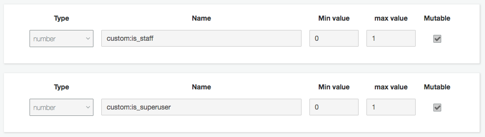

# Django Barrier Field

## Introduction

Barrier field is an authentication backend for django that uses AWS Cognito to authenticate and store secure user data.

Barrier field supports the following:

* Login/Authentication
* User creation/registration
* Temporary passwords and forced password changes
* Enabling and disabling users
* Synchronisation with Django
* Multi-factory authentication (MFA) via Software or SMS
* Custom attributes
* Required attributes
* Forgotten passwords

## Setup

In the settings file for your django app.

First add barrier_field to the list of `INSTALLED_APPS`

```python
INSTALLED_APPS = [
    ...
    'barrier_field',
    ...
]
```

### AWS Setup

The following AWS settings should be added to the settings file of you app.

```python
import boto3

boto3.setup_default_session(region_name='<region-name>')
AWS_ACCESS_KEY_ID = '<AWS ACCESS KEY>'
AWS_SECRET_ACCESS_KEY = '<AWS SECRET KEY>'
```

Specify your cognito user pool details like so:

```python
COGNITO_USER_POOL_ID = '<COGNITO USER POOL ID>'
COGNITO_APP_ID = '<COGNITO CLIENT APP ID>'
```

### Set authentication backend

Add barrier field cognito auth to authentication backends.

```python
AUTHENTICATION_BACKENDS = [
  'barrier_field.backend.CognitoAuth',
  'django.contrib.auth.backends.ModelBackend',
  '...'
]
```

### Set user model

Barrier field includes a user model which adds 2 additional fields (1 required and 1 option, see [USER_DATA_MODEL](#link)) and functions for syncing user data with Cognito.

Add the following to your settings file.

```python
AUTH_USER_MODEL = 'barrier_field.User'
```

### Set user data model (optional)

If your Cognito user contains any "Custom attributes" (see [custom attributes](#Custom_attributes)) or any "Standard attributes" outside the base Django user fields (first name, last name, email, phone) for example birthdate or address, a user data model should be created to store them.

A model containing these fields must be specified if your app, then set in the settings.


Model example:
```python
from django.db import models

class UserDetails(models.Model):
    name = models.CharField(max_length=255, blank=True)
    locale = models.CharField(max_length=255, blank=True)
    gender = modelsCharField(max_length=10, blank=True)

```

Settings:
```python
USER_DATA_MODEL = 'some_app.UserDetails'
```

### Standard attributes

"Standard attributes" refers to the built in attributes supplied with Cognito.

### Custom attributes

Cognito allows you to store custom attributes for the users in your pool. To fully sync with Django, attributes for "is_superuser" and "is_staff" must be created.




Should you add any more custom attributes to your Cognito users, to sync that data with Django you will need to specify the name and type of the attributes in your app settings.

```python
CUSTOM_ATTRS = {
    'is_superuser': bool,
    'is_staff': bool,
    ...
    'some_string': str,
    'some_number': int
}
```

Cognito doesn't have native support for booleans, so instead it's advised you set the type to integer, with a min value of 0 and a max value of 1. When a custom attribute has type "bool", Barrier Field will translate that value to a integer for cognito. See the superuser/staff setup above for an example.

### Required attributes

Define whether an attribute is required. This is used in conjunction with the [create user manage command](#create_user)

### User database

The user data store in the database acts as a cache for data from Cognito which django can use to access userdata while logged in.

You can chose to clear that data  every time the user logs out by adding the following to your app's settings.

```python
CLEAR_USER_ON_LOGOUT = True
```

## Manage commands

Barrier field comes with commands to:

* Create users
* List users
* Delete users

### Create user

The create user command pulls information from [custom attributes](), [standard attributes]() and [required attributes](). 

```python
python manage.py create_cognito_user some@address.com <required_attribute>
-- telephone <Telephone number>
-- temporary_password <Temporary password>
-- <custom_attribute>
```

### Delete user

Delete a user from Cognito. _Warning: This is permanent!_

```python
python manage.py delete_cognito_user some@address.com
```

### List users

Return a list of all Cognito user and their attributes

```python
python manage.py list_cognito_users
```